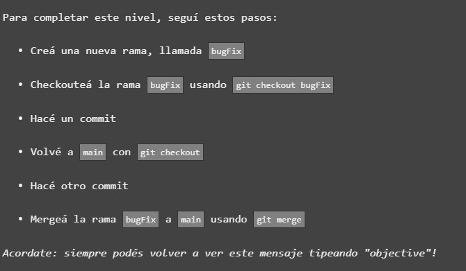
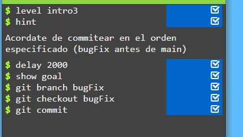

# Introducción ejercicio

En este tercer ejecicio aprenderemos el concepto "merge" o "mergear" cuando trabajamos con GIT. En la imagen a continuacion la consola nos ayuda a entender mejor en qué consiste este concepto:

Como podemos ver, y entender, mergear consistirá en "mezclar" o incluir los cambios realizados en los archivos de una rama del proyecto en la rama principal para tener asi todos los cambios unificados y centralizados en una unica rama.

Comencemos pues a la resolución de este ejercicio:

## Resolviendo ejercicio

Al comenzar el ejercicio se nos proporcionan los siguientes pasos a realizar

### Primer paso, crear la nueva rama bugFix

Introducimos por linea de comandos **git branch bugFix** y asi lograremos crear la nueva rama

Vemos como la interfaz corrobora la creación de la misma, pero aun estamos en la rama main

Cambiamos a la rama creada por medio de **git checkout bugFix**

Mostrando el cambio correspondiente en la interfaz

Una vez cambiados, para hacer el merge deberemos commitear la rama creada.
Como ya hemos aprendido, realizaremos este paso por medio del comando **git commit -m "mensaje"

>Vemos como el tutorial nos permite realizar el commit sin añadir texto informativo a la entrega. En la practica, es siempre recomendable añadir texto informativo para el tracking del proyecto por si otros desarrolladores se involucran en nuestro proyecto

La interfaz grafica evoluciona en consecuencia al commit realizado

